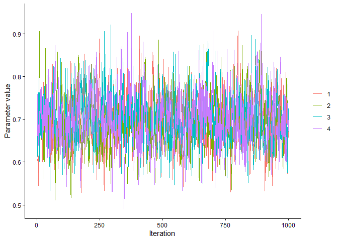
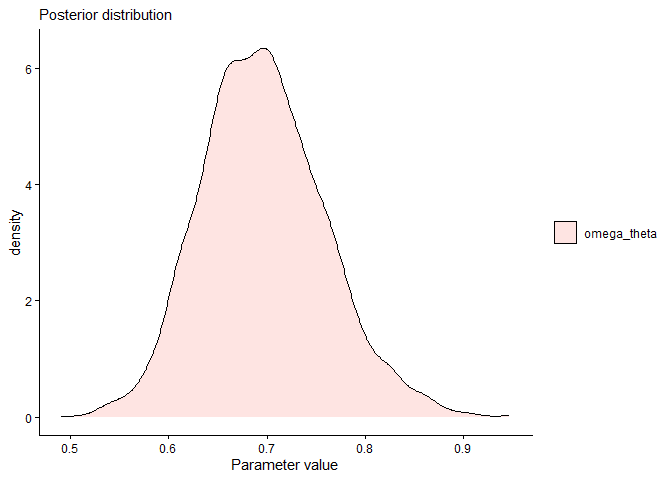

<!-- Dieses RMarkdown Dokument dient dazu, ein Readme-Markdown-Dokument zu knitten.  Dieses Read-me wird man sehen, wenn man auf die Paket Development Page of Github geht.  -->

# 1 The BayesDiffIRT for R

The `BayesDiffIRT` provides functions to sample posterior distributions
and posterior predictive distributions of item and subject parameters of
diffusion item response theory models for responses and reaction times
Kang, De Boeck, and Ratcliff (2022) `BayesDiffIRT` also provides
functions to visualize posterior distributions of Diffusion item
response theory model parameters and construct credible intervals. Under
the hood, the package relies on NUTS sampling with STAN (Carpenter et
al. 2017). Up to know, the following diffusion item response theory
models have been implemented:

- D-diffusion model (Tuerlinckx and Boeck 2005),
- Q-diffusion model (Van Der Maas et al. 2011),
- D-diffusion model with random variability (Kang, De Boeck, and
  Ratcliff 2022),
- Q-diffusion model with random variability (Kang, De Boeck, and
  Ratcliff 2022).

The two versions of the D-diffusion model are appropriate for survey
items where persons decide whether to accept or reject an item. The two
flavours of the Q-diffusion model were designted to model ability tests.

# 2 Mathematical description of diffusion item response theory models

Diffusion item response theory combines item response theory with the
drift diffusion model of decision making. According to the drift
diffusion decision model (Stone 1960; Link and Heath 1975; Ratcliff et
al. 2016), the sensory system repeatedly generates momentary evidence
about which of two possible choice options is correct. This momentary
evidence is drawn from a Gaussian distribution and accumulated over
time. The newly acquired evidence is therefore continuously added to the
evidence collected up to that moment.The accumulation process is bounded
by an upper and a lower threshold, where each threshold represents one
of the two possible choice options. When the accumulated evidence
reaches one of the thresholds, a choice is made for the corresponding
option. The quality of information favouring one response option over
the other is reflected in the drift rate $`\delta`$, which quantifies
how quickly the accumulated evidence approaches the threshold associated
with the correct or preferred decision. The distance between the two
thresholds, $`\alpha`$, determines the amount of evidence required
before a decision is made; a larger distance means that decisions tend
to be slower because more evidence is required. The starting point
$`\beta`$ of the accumulation process reflects an a priori bias toward
one of the response options. To visualize the reaction time
distributions that follow from the drift diffusion model, interactive
tools such as the [diffusion model visualizer](https://osf.io/4en3b) are
openly available (Alexandrowicz 2020).

In diffusion item response theory models, two traditional parameters of
the drift diffusion model, boundary separation and drift rate, are
decomposed into person and item parameters (Tuerlinckx and Boeck 2005).
When person $`p`$ makes a decision about item $`i`$, the boundary
separation is given by

``` math

\alpha_{pi} = \frac{\gamma_p}{a_i},
```

where $`\gamma_p`$ represents person-specific response caution and
$`a_i`$ represents item-specific time pressure.

The D-diffusion and Q-diffusion models differ in how the drift rate is
decomposed. In the D-diffusion model (Tuerlinckx and Boeck 2005), which
is applicable to survey items, the drift rate is given by

``` math

\delta_{pi} = \theta_p - \nu_i.
```

According to the Q-diffusion model (Van Der Maas et al. 2011), which is
applicable to ability tests, the drift rate is given by

``` math

\delta_{pi} = \frac{\theta_p}{\nu_i}.
```

In both the D-diffusion and Q-diffusion models, the accumulation process
starts midway between the two response alternatives. Thus, there is no a
priori bias toward either choice alternative.

Kang, De Boeck, and Ratcliff (2022) proposed extensions that include
random trial-to-trial variability in both the starting point $`\beta`$
and the drift rate $`\delta`$. In the Q- and D-diffusion models with
random variation, the starting point $`\beta_{pij}`$ for trial $`j`$,
item $`i`$, and person $`p`$ is sampled from a uniform distribution,

``` math

\beta_{pij} \sim \mathcal{U}\left(0.5 - \frac{s_{\beta}}{2}, 0.5 + \frac{s_{\beta}}{2}\right).
```

The drift rate $`\delta_{pij}`$ for trial $`j`$, item $`i`$, and person
$`p`$ is sampled from a Gaussian distribution,

``` math

\delta_{pij} \sim \mathcal{N}\left(\delta_{pi}, s_{\delta}^2\right).
```

Random variability in starting points and drift rates accounts for the
conditional dependency between accuracy and reaction times (Kang, De
Boeck, and Ratcliff 2022), but note that sampling is considerably slower
for these models.

# 3 Installation

The the development version is available on GitHub. The easiest way to
install is using the `devtools` package:

<!-- without any dots, the code chunk will be shown, but not executed -->

    devtools::install_github("ManuelRausch/BayesDiffIRT")

# 4 Usage

## 4.1 Fitting drift diffusion item response theory models

The function `fitBayesDiffIRT` fits Bayesian diffusion item-response
theory models by sampling from the posterior distributions of item and
subject parameters using the No-U-Turn Sampler (NUTS) as implemented in
Stan (Carpenter et al. 2017). The data must contain columns identifying
the subject, item, response, and response time. Response times should be
numeric and measured in seconds. For ability tests, binary responses
should be coded as 0 for incorrect responses and 1 for correct
responses. For questionnaire items, binary responses should be coded as
0 for rejected items and 1 for accepted items.

``` r
# Example for preparing the data set.
library(tidyverse)
```

    ## Warning: Paket 'ggplot2' wurde unter R Version 4.5.3 erstellt

    ## Warning: Paket 'tibble' wurde unter R Version 4.5.3 erstellt

    ## Warning: Paket 'lubridate' wurde unter R Version 4.5.3 erstellt

    ## ── Attaching core tidyverse packages ──────────────────────── tidyverse 2.0.0 ──
    ## ✔ dplyr     1.2.1     ✔ readr     2.1.5
    ## ✔ forcats   1.0.1     ✔ stringr   1.6.0
    ## ✔ ggplot2   4.0.3     ✔ tibble    3.3.1
    ## ✔ lubridate 1.9.5     ✔ tidyr     1.3.2
    ## ✔ purrr     1.2.0     
    ## ── Conflicts ────────────────────────────────────────── tidyverse_conflicts() ──
    ## ✖ dplyr::filter() masks stats::filter()
    ## ✖ dplyr::lag()    masks stats::lag()
    ## ℹ Use the conflicted package (<http://conflicted.r-lib.org/>) to force all conflicts to become errors

``` r
data(extraversion, package = "diffIRT")
Extra <- as.data.frame(extraversion)
names(Extra)[1:10]  <- paste0("Item", 1:10, "_resp")
names(Extra)[11:20] <- paste0("Item", 1:10, "_rt")
Extra$sbj <- 1:nrow(Extra)
  
Extra <- tidyr::pivot_longer(
  Extra,
  cols = tidyselect::matches("^Item\\d+_(resp|rt)$"),
  names_to = c("item", ".value"),
  names_pattern = "^(Item\\d+)_(resp|rt)$"
)

Extra$item <- factor(Extra$item)
Extra$item <- factor(Extra$item)
head(Extra)
```

    ## # A tibble: 6 × 4
    ##     sbj item   resp    rt
    ##   <int> <fct> <dbl> <dbl>
    ## 1     1 Item1     0 2.73 
    ## 2     1 Item2     1 0.915
    ## 3     1 Item3     1 3.48 
    ## 4     1 Item4     1 1.02 
    ## 5     1 Item5     1 1.11 
    ## 6     1 Item6     0 2.38

Priors distributions for parameter classes are specified using the
function `prior()`. The function creates objects of class
`BayesDiffIRTPrior`, which can be passed to the `priors` argument of
`fitBayesDiffIRT`. Priors are specified using Stan distribution syntax,
for example `normal(0, 1)` or `lognormal(0, 0.5)`. Priors on the
following parameters can be specified:

| Parameter | Description |
|----|----|
| `"omega_theta"` | Standard deviation of `theta`, the latent trait. |
| `"omega_gamma"` | Standard deviation of `gamma`, the item response tendency parameter. |
| `"nu"` | Item difficulty parameter. |
| `"a"` | Item boundary separation parameter. |
| `"tnd"` | Person-specific non-decision time. |
| `"s_delta"` | Standard deviation of Gaussian trial-to-trial variability in drift rate. Only relevant for models `"dRV"` and `"qRV"`. |
| `"s_beta"` | Range of uniform trial-to-trial variability in starting point. Only relevant for models `"dRV"` and `"qRV"`. |

If priors are supplied for only some parameter classes, the remaining
parameter classes are filled in with their model-specific defaults.

``` r
# Example for prior specification
library(BayesDiffIRT)
```

    ## BayesDiffIRT: Bayesian diffusion-IRT models with RTs.
    ## Backend: cmdstanr.

``` r
myPrior <-  list(prior(normal(0, 2.5), class = "omega_theta"),
               prior(normal(0, 0.5), class = "omega_gamma"),
               prior(lognormal(0, 0.75), class = "nu"),
               prior(lognormal(0, 0.5), class = "a"),
               prior(lognormal(-1.25, 0.3), class = "tnd"))
```

Finally, a string identifying the chosen model, the prepared data and a
list of priors should be passed to `fitBayesDiffIRT` to fit a Bayesian
diffusion item-response theory model. The following model names are
recognized:

- “d” for the D-diffusion model (for survey items, default),
- “dRV” for the D-diffusion model with random variability (for survey
  items),
- “q” for the Q-diffusion model (for ability tests),
- “qRV” for the Q-diffusion model with random variability (for ability
  tests).

``` r
samples <- 
  fitBayesDiffIRT(Extra,
                  rt = "rt", resp = "resp", sbj = "sbj",
                  item = "item", model = "d")
```

    ## In file included from stan/src/stan/model/model_header.hpp:5:
    ## stan/src/stan/model/model_base_crtp.hpp:205:8: warning: 'void stan::model::model_base_crtp<M>::write_array(stan::rng_t&, std::vector<double>&, std::vector<int>&, std::vector<double>&, bool, bool, std::ostream*) const [with M = ddiffusion_model_namespace::ddiffusion_model; stan::rng_t = boost::random::mixmax_engine<17, 36, 0>; std::ostream = std::basic_ostream<char>]' was hidden [-Woverloaded-virtual=]
    ##   205 |   void write_array(stan::rng_t& rng, std::vector<double>& theta,
    ##       |        ^~~~~~~~~~~

    ## C:/Users/marausch/AppData/Local/Temp/RtmpeINp8S/model-38e435d22dd2.hpp:1348: note:   by 'ddiffusion_model_namespace::ddiffusion_model::write_array'
    ##  1348 |   write_array(RNG& base_rng, std::vector<double>& params_r, std::vector<int>&
    ## stan/src/stan/model/model_base_crtp.hpp:136:8: warning: 'void stan::model::model_base_crtp<M>::write_array(stan::rng_t&, Eigen::VectorXd&, Eigen::VectorXd&, bool, bool, std::ostream*) const [with M = ddiffusion_model_namespace::ddiffusion_model; stan::rng_t = boost::random::mixmax_engine<17, 36, 0>; Eigen::VectorXd = Eigen::Matrix<double, -1, 1>; std::ostream = std::basic_ostream<char>]' was hidden [-Woverloaded-virtual=]
    ##   136 |   void write_array(stan::rng_t& rng, Eigen::VectorXd& theta,
    ##       |        ^~~~~~~~~~~
    ## C:/Users/marausch/AppData/Local/Temp/RtmpeINp8S/model-38e435d22dd2.hpp:1348: note:   by 'ddiffusion_model_namespace::ddiffusion_model::write_array'
    ##  1348 |   write_array(RNG& base_rng, std::vector<double>& params_r, std::vector<int>&

## 4.2 Inspecting the results

The results of a fitted Bayesian diffusion item-response theory model
can be inspected using the function `summary`.

``` r
summary(samples)
```

    ## Summary of BayesDiffIRT model fit
    ## ---------------------------------
    ## Model: D-Diffusion model 
    ## 
    ## Data:
    ##   Observations: 1429 
    ##   Persons:      143 
    ##   Items:        10 
    ## 
    ## Call:
    ## fitBayesDiffIRT(data = Extra, rt = "rt", resp = "resp", sbj = "sbj", 
    ##     item = "item", model = "d")
    ## 
    ## Posterior summaries:
    ## 
    ## Hyperparameters:
    ## # A tibble: 2 × 9
    ##   variable     mean median    sd    q5   q95  rhat ess_bulk ess_tail
    ##   <chr>       <dbl>  <dbl> <dbl> <dbl> <dbl> <dbl>    <dbl>    <dbl>
    ## 1 omega_theta   0.7   0.69  0.06  0.6   0.8      1    1263.    1781.
    ## 2 omega_gamma   0.2   0.2   0.03  0.16  0.25     1     821.    1309.
    ## 
    ## Item parameters:
    ## # A tibble: 20 × 9
    ##    variable  mean median    sd    q5   q95  rhat ess_bulk ess_tail
    ##    <chr>    <dbl>  <dbl> <dbl> <dbl> <dbl> <dbl>    <dbl>    <dbl>
    ##  1 nu[1]    -0.65  -0.65  0.11 -0.82 -0.48     1    1749.    2414.
    ##  2 nu[2]    -0.14  -0.15  0.1  -0.31  0.02     1    1891.    2659 
    ##  3 nu[3]    -1.23  -1.24  0.13 -1.45 -1.02     1    2420.    2533.
    ##  4 nu[4]    -1.7   -1.7   0.14 -1.93 -1.46     1    2200.    2799.
    ##  5 nu[5]    -0.21  -0.21  0.11 -0.38 -0.03     1    1733.    2282.
    ##  6 nu[6]    -1.3   -1.3   0.12 -1.5  -1.11     1    2153.    2742.
    ##  7 nu[7]    -1.69  -1.69  0.14 -1.93 -1.46     1    2275.    2818.
    ##  8 nu[8]    -1.91  -1.91  0.15 -2.16 -1.68     1    2046.    2822.
    ##  9 nu[9]    -0.83  -0.83  0.1  -1    -0.66     1    1680.    2061.
    ## 10 nu[10]   -1.42  -1.42  0.14 -1.65 -1.19     1    2405.    2389.
    ## 11 a[1]      0.44   0.44  0.02  0.41  0.47     1    2807.    2682.
    ## 12 a[2]      0.49   0.49  0.02  0.46  0.53     1    2140.    2529.
    ## 13 a[3]      0.49   0.49  0.02  0.46  0.54     1    2125.    2662.
    ## 14 a[4]      0.51   0.51  0.03  0.47  0.55     1    1999.    2552.
    ## 15 a[5]      0.51   0.51  0.02  0.47  0.55     1    2240.    2542.
    ## 16 a[6]      0.43   0.43  0.02  0.4   0.47     1    2583.    2452.
    ## 17 a[7]      0.4    0.4   0.02  0.37  0.44     1    2482.    3111.
    ## 18 a[8]      0.42   0.42  0.02  0.38  0.46     1    2318.    2892.
    ## 19 a[9]      0.35   0.35  0.02  0.32  0.38     1    2823.    2970.
    ## 20 a[10]     0.55   0.55  0.03  0.51  0.59     1    2105.    2663.
    ## 
    ## Subject parameters:
    ## # A tibble: 429 × 9
    ##    variable  mean median    sd    q5   q95  rhat ess_bulk ess_tail
    ##    <chr>    <dbl>  <dbl> <dbl> <dbl> <dbl> <dbl>    <dbl>    <dbl>
    ##  1 tnd[1]    0.37   0.36  0.1   0.22  0.54     1    5755.    2877.
    ##  2 tnd[2]    0.4    0.4   0.09  0.25  0.54     1    3737.    3196.
    ##  3 tnd[3]    0.46   0.46  0.11  0.27  0.64     1    4551.    3564.
    ##  4 tnd[4]    0.27   0.27  0.06  0.18  0.36     1    5968.    3130.
    ##  5 tnd[5]    0.39   0.39  0.08  0.25  0.51     1    4388.    2859.
    ##  6 tnd[6]    0.31   0.31  0.06  0.21  0.41     1    4349.    3332.
    ##  7 tnd[7]    0.39   0.39  0.09  0.24  0.52     1    4538.    3098.
    ##  8 tnd[8]    0.52   0.52  0.15  0.27  0.77     1    3990.    3510.
    ##  9 tnd[9]    0.34   0.34  0.07  0.21  0.46     1    5708.    3130.
    ## 10 tnd[10]   0.43   0.42  0.12  0.24  0.64     1    5313.    3135.
    ## # ℹ 419 more rows
    ## 
    ## Other parameters:
    ## # A tibble: 429 × 9
    ##    variable     mean median    sd    q5   q95  rhat ess_bulk ess_tail
    ##    <chr>       <dbl>  <dbl> <dbl> <dbl> <dbl> <dbl>    <dbl>    <dbl>
    ##  1 z_theta[1]  -0.83  -0.82  0.36 -1.43 -0.25     1    4458.    2674.
    ##  2 z_theta[2]  -0.31  -0.32  0.55 -1.19  0.62     1    5949.    2729.
    ##  3 z_theta[3]   0.39   0.39  0.53 -0.49  1.26     1    5324.    3092.
    ##  4 z_theta[4]   0.49   0.49  0.45 -0.25  1.24     1    5163.    3014.
    ##  5 z_theta[5]   1.47   1.44  0.68  0.39  2.59     1    6189.    3271.
    ##  6 z_theta[6]  -0.08  -0.08  0.54 -0.96  0.8      1    6965.    2771.
    ##  7 z_theta[7]  -0.07  -0.08  0.52 -0.92  0.79     1    5604.    3013.
    ##  8 z_theta[8]   0.33   0.31  0.55 -0.52  1.25     1    4551.    2334.
    ##  9 z_theta[9]   0.26   0.26  0.46 -0.5   1.05     1    4771.    2923.
    ## 10 z_theta[10]  0.37   0.35  0.43 -0.31  1.09     1    4937.    2702.
    ## # ℹ 419 more rows

`checkDiagnostics` provides common Stan diagnostics such as number of
divergeant transitions, R hat, effective sample size, maximum treedepth
hits, and E-BFMI.

``` r
checkDiagnostics(samples)
```

    ## Stan diagnostics
    ## ----------------
    ## Chains:               4
    ## Divergences:          0
    ## Max treedepth hits:   0
    ## R-hat warnings:       0
    ## Low ESS warnings:     0
    ## E-BFMI warnings:      0
    ## 
    ## Overall status:        OK

Marcov chains of selected parameters can be visualized using the `plot`
method:

``` r
plot(samples, parameter = "omega_theta", type = "trace")
```

    ## Warning: Dropping 'draws_df' class as required metadata was removed.

<!-- -->

There is also the possibility to plot posterior means with 50% and 95%
credible intervals as well as marginal posterior densities.

``` r
plot(samples, parameter = "theta", type = "interval")
```

    ## Warning: Dropping 'draws_df' class as required metadata was removed.

<!-- -->

``` r
plot(samples, parameter = "omega_theta",
     type = "density")
```

    ## Warning: Dropping 'draws_df' class as required metadata was removed.

<!-- -->

<!-- Posterior predictive distibution hinzufügen!  -->

# 5 Contributing to the package

The package is under active development. Please feel free to [contact
us](mailto:manuel.rausch@aau.at) to suggest diffusion item response
theory models that we might have not yet implemented, or to volunteer
adding additional features.

# 6 Contact

For comments, bug reports, and feature suggestions please feel free to
either write to <manuel.rausch@aau.at> or [submit an
issue](https://github.com/ManuelRausch/BayesDiffIRT/issues).

# 7 References

<div id="refs" class="references csl-bib-body hanging-indent"
entry-spacing="0">

<div id="ref-alexandrowicz_diffusion_2020" class="csl-entry">

Alexandrowicz, Rainer W. 2020. “The Diffusion Model Visualizer: An
Interactive Tool to Understand the Diffusion Model Parameters.”
*Psychological Research* 84 (4): 1157–65.
<https://doi.org/10.1007/s00426-018-1112-6>.

</div>

<div id="ref-carpenter_stan_2017" class="csl-entry">

Carpenter, Bob, Andrew Gelman, Matthew D. Hoffman, Daniel Lee, Ben
Goodrich, Michael Betancourt, Marcus Brubaker, Jiqiang Guo, Peter Li,
and Allen Riddell. 2017. “*Stan* : A Probabilistic Programming
Language.” *Journal of Statistical Software* 76 (1).
<https://doi.org/10.18637/jss.v076.i01>.

</div>

<div id="ref-kang_modeling_2022" class="csl-entry">

Kang, Inhan, Paul De Boeck, and Roger Ratcliff. 2022. “Modeling
Conditional Dependence of Response Accuracy and Response Time with the
Diffusion Item Response Theory Model.” *Psychometrika* 87 (2): 725–48.
<https://doi.org/10.1007/s11336-021-09819-5>.

</div>

<div id="ref-link_sequential_1975" class="csl-entry">

Link, S. W., and R. A. Heath. 1975. “A Sequential Theory of
Psychological Discrimination.” *Psychometrika* 40 (1): 77–105.
<https://doi.org/10.1007/BF02291481>.

</div>

<div id="ref-molenaar_fitting_2015" class="csl-entry">

Molenaar, Dylan, Francis Tuerlinckx, and Han L. J. Van Der Maas. 2015.
“Fitting Diffusion Item Response Theory Models for Responses and
Response Times Using the *r* Package **diffIRT**.” *Journal of
Statistical Software* 66 (4). <https://doi.org/10.18637/jss.v066.i04>.

</div>

<div id="ref-Ratcliff2016" class="csl-entry">

Ratcliff, Roger, Philip L Smith, Scott D Brown, and Gail McKoon. 2016.
“Diffusion Decision Model : Current Issues and History.” *Trends in
Cognitive Sciences* 20 (4): 260–81.
<https://doi.org/10.1016/j.tics.2016.01.007>.

</div>

<div id="ref-stone_models_1960" class="csl-entry">

Stone, Mervyn. 1960. “Models for Choice-Reaction Time.” *Psychometrika*
25 (3): 251–60. <https://doi.org/10.1007/BF02289729>.

</div>

<div id="ref-tuerlinckx_two_2005" class="csl-entry">

Tuerlinckx, Francis, and Paul De Boeck. 2005. “Two Interpretations of
the Discrimination Parameter.” *Psychometrika* 70 (4): 629–50.
<https://doi.org/10.1007/s11336-000-0810-3>.

</div>

<div id="ref-van_der_maas_cognitive_2011" class="csl-entry">

Van Der Maas, Han L. J., Dylan Molenaar, Gunter Maris, Rogier A. Kievit,
and Denny Borsboom. 2011. “Cognitive Psychology Meets Psychometric
Theory: On the Relation Between Process Models for Decision Making and
Latent Variable Models for Individual Differences.” *Psychological
Review* 118 (2): 339–56. <https://doi.org/10.1037/a0022749>.

</div>

</div>
